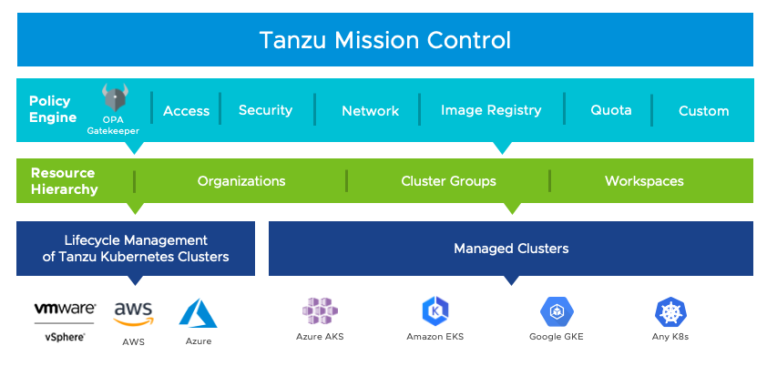
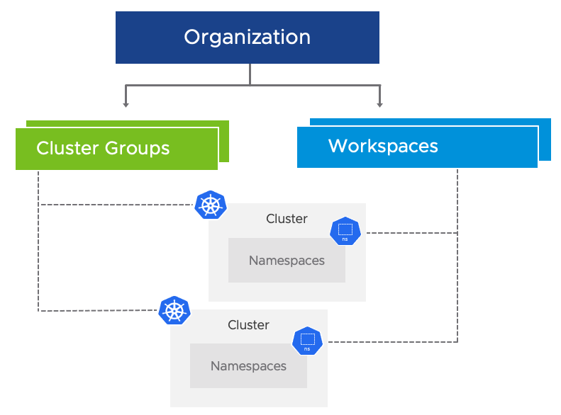
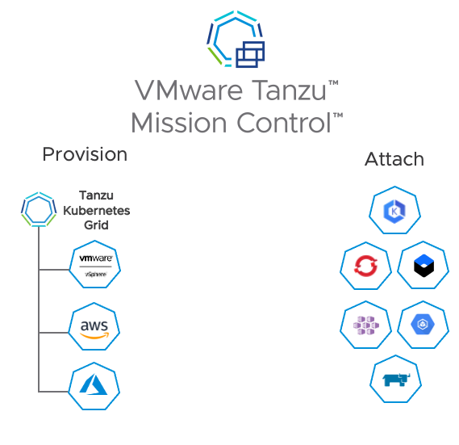
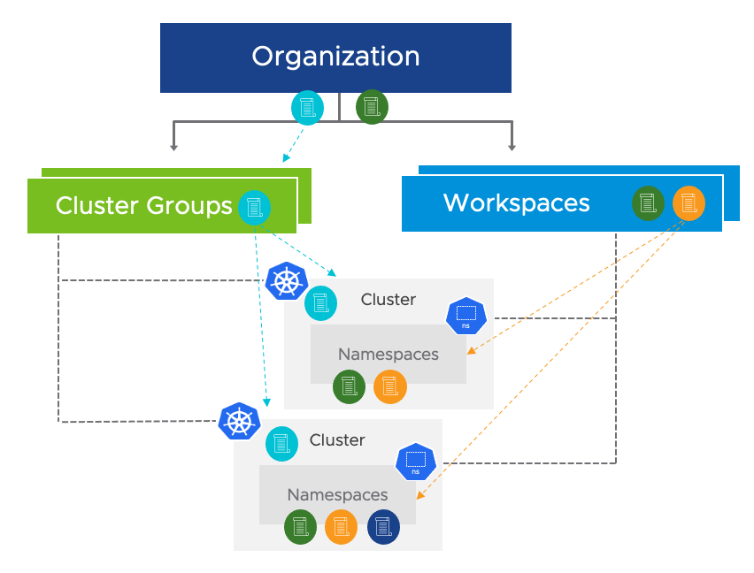

# **Module 1: TMC Fundation**

## **VMware Tanzu Mission Control Concepts**

VMware Tanzu Mission Control is a platform for modern application management that provides a single control point for teams to more easily manage Kubernetes and operate modern containerized applications across multiple clouds and clusters. As an API-driven service, Tanzu Mission Control enables you to declaratively manage all your clusters through its API, the CLI, or the web-based console

Some of the cluster management capabilities of Tanzu Mission Control include:

- Cluster Lifecycle Management
- Cluster Observability and Diagnostics
- Cluster Inspections
- Data Protection
- Access Control
- Policy Management

**Organizing Clusters and Namespaces**

Through the Tanzu Mission Control console you can organize and view your Kubernetes resources in two different ways, enabling operations administrators to maintain control over clusters and infrastructure while allowing application teams self-serve access to namespaces.

- <ins>Cluster groups</ins> provide an infrastructure view.

    Cluster groups allow you to organize your Kubernetes clusters into logical groupings, for example to align with business units. To get you started, Tanzu Mission Control provides a default cluster group, but you should create cluster groups to fit your business needs.

- <ins>Workspaces</ins> provide an application view

    Workspaces allow you to organize your managed namespaces into logical groups across clusters, perhaps to align with development projects. To get you started, Tanzu Mission Control provides a default workspace, but you should create workspaces to fit your business needs.

**Attached and Provisioned Clusters**

Using Tanzu Mission Control, you can attach existing Kubernetes clusters from various cloud providers, organize them into logical groups, observe their health, and manage their security posture and configuration. You can also provision clusters directly through Tanzu Mission Control, provisioned in your own cloud provider account using Cluster API, to leverage the built-in cluster lifecycle management best practices.

**Policy-Driven Cluster Management**

Policies allow you to provide a set of rules that govern your organization and all the objects it contains. 

The policy types available in Tanzu Mission Control include the following:

- <ins>access policy</ins>
Access policies allow you to use predefined roles to specify which identities (individuals and groups) have what level of access to a given resource. 

- <ins> image registry policy</ins>
Image registry policies allow you to specify the source registries from which an image can be pulled.

- <ins> network policy</ins>
Network policies allow you to use preconfigured templates to define how pods communicate with each other and other network endpoints.

- <ins> quota policy</ins>
Quota policies allow you to constrain the resources used in your clusters, as aggregate quantities across specified namespaces, using preconfigured and custom templates.

- <ins> security policy</ins>
Security policies allow you to manage the security context in which deployed pods operate in your clusters by imposing constraints on your clusters that define what pods can do and which resources they have access to. 

- <ins> custom policy</ins>
Custom policies allow you to implement additional business rules, using templates that you define, to enforce policies that are not already addressed using the other built-in policy types.

**Tanzu Mission Control Versions**

Tanzu Mission Control is offered in multiple versions, tailoring the set of features to your cluster management needs.

Many of the features and capabilities are available in all versions. Some features, like certain policy types and inspection types, are available only with some versions. For more information about the features available in Tanzu Mission Control for each version, see the [VMware Tanzu Mission Control Feature Comparison Chart](ttps://tanzu.vmware.com/content/tanzu-mission-control/tmc-comparison-chart).

- <ins>Tanzu Mission Control Essentials</ins>

    Crafted specifically for Tanzu services on VMware Cloud offerings like VMware Cloud on AWS, Tanzu Mission Control Essentials provides a set of essential capabilities to organize your Kubernetes clusters and namespaces for scalable operations, and secure them with access control policies.

- <ins>Tanzu Mission Control Standard</ins>

    The standard version of Tanzu Mission Control comes with Tanzu Standard Edition, and provides an expanded set of capabilities for enterprises to manage Kubernetes across clusters, clouds, and teams. In addition to the basic multi-cloud, multi-cluster management capabilities included in Tanzu Mission Control Essentials, the standard version also offers capabilities like data protection and conformance inspection.

- <ins>Tanzu Mission Control Advanced</ins>

    The advanced version of Tanzu Mission Control is available standalone or with the Tanzu Advanced Edition, and contains all currently available functionality. This includes custom roles for access policies, additional policy types like networking, quota, and image registry policies, as well as custom policies for more granular control over your Kubernetes deployments.

