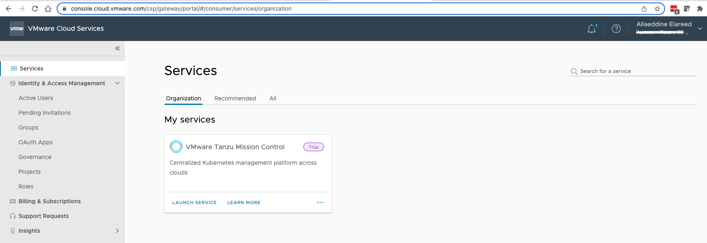

**Prerequisites**

To access the Tanzu Mission Control console, you must first make sure you have access to the Tanzu Mission Control service, as described in Get Access to Tanzu Mission Control below.

```dashboard:open-url
url: https://docs.vmware.com/en/VMware-Tanzu-Mission-Control/services/tanzumc-getstart/GUID-5EE71386-4279-4A31-974B-648BA3A9AEEC.html#GUID-5EE71386-4279-4A31-974B-648BA3A9AEEC
```

**Procedure**

1. Open a browser and log in to the VMware Cloud Services.

```dashboard:open-url
url: https://console.cloud.vmware.com
```




2. If you belong to multiple organizations, make sure you have selected **{{ ENV_VMWARE_CLOUD_ORG_NAME }}**. To change organizations, click your name in the title bar.

3. Click the Tanzu Mission Control tile to open the Tanzu Mission Control console. After you have logged in, you can return directly to the Tanzu Mission Control console using the following URL.

```dashboard:open-url
url: {{ ENV_TMC_URL }}
```

**Authenticate to TMC CLI**

If you don't have an API token to access TMC, see [How Do I Generate API Tokens](https://docs.vmware.com/en/VMware-Cloud-services/services/Using-VMware-Cloud-Services/GUID-E2A3B1C1-E9AD-4B00-A6B6-88D31FCDDF7C.html) documentation.   

* Provide your API Token and press enter
* For the login context name, leave it to default


```execute-1
tmc login -n {{ session_namespace }} --no-configure
```

* Configure environment defaults that make the CLI easier to use. 

```execute-1
tmc system context configure -l "log" -m attached -p attached
```

```workshop:copy-and-edit
text: tmc system context configure -l "log" -m {{ session_namespace }}-mgmt -p <put you vSphere namespace here>
```