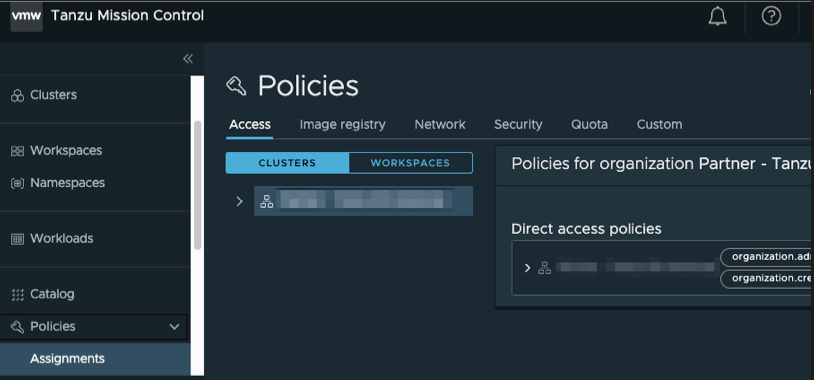
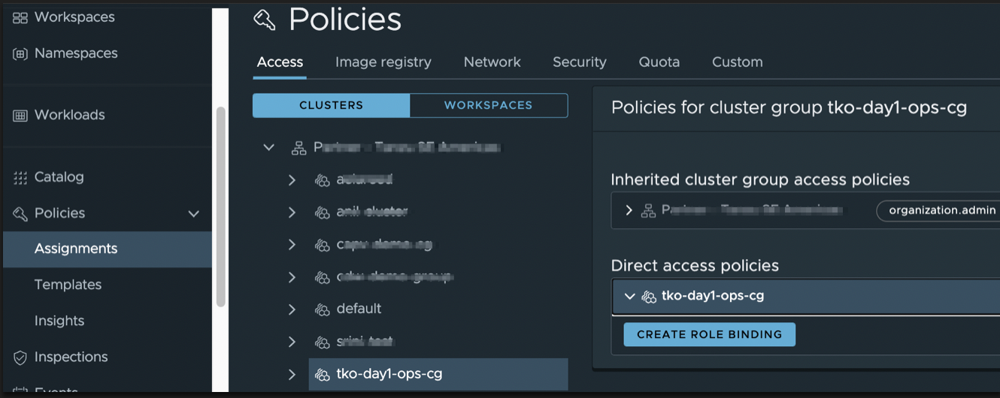
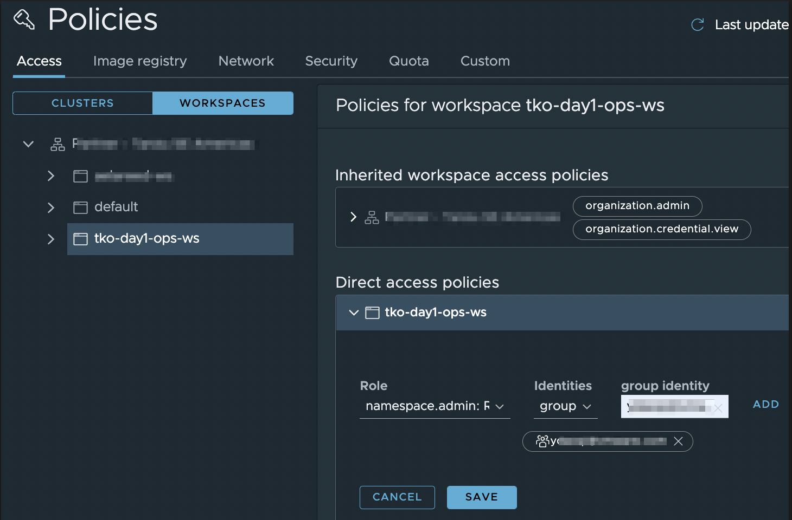

VMware Tanzu Mission Control uses secure-by-default, role-based access control (RBAC) to manage user permissions at each level of the hierarchical structure for your organization. Each object is protected by an access policy that defines who has access to that resource, and these policies are inherited down through the organizational hierarchy.

Access policies can be managed at the cluster group level or workspace level.

To grant a user or group an access privilege, click on Policies and then Assigments from the left pane, as shown below:



To edit the access policy for an object, you must be associated with the *.admin* role for that object.

***Access Policy  at Cluster Group Level***

Access policies may be configured at the cluster group level. Click on 
Access in the right pane and then Clusters.
In the organizational view on the Access tab of the Policies page, select the object whose access policy you want to add a role binding to.



- Click on the cluster group:  *tko-day1-ops-cg*. 
- Click the arrow next to the object name under Direct access policies.
- Click Create Role Binding.
- Select the *cluster.admin* role to grant administrative access to this cluster group that you want to bind to an identity.
- Select the identity type (user or group) that you want to bind.
- Enter one or more identities, clicking Add after each identity, and then click Save.


***Access Policy  at Workspace Level***

Access policies may be configured at the workspace level. Click on Access and then Workspaces:


Then click on the workspace: *tko-day1-ops-ws*. Similar to the steps given above, we can grant a desired
role binding to the workspace:  *tko-day1-ops-ws* as shown below. 
This time grant the *namespace.admin* privilege to a group of users. 
 Click Add after each identity, and then click Save.




[//]: # (This is a comment line)
Now let us use TMC CLI to add an access policy, which
grants *cluster.edit* privilege to a user: *user01*: 
```execute-1
tmc cluster iam add-binding {{ session_namespace }}-cluster -r cluster.edit -u user01 
```

This command retrieves the access policies for the cluster *{{ session_namespace }}-cluster* in yaml format:
```execute-1
tmc cluster iam get-policy {{ session_namespace }}-cluster -o yaml
```
