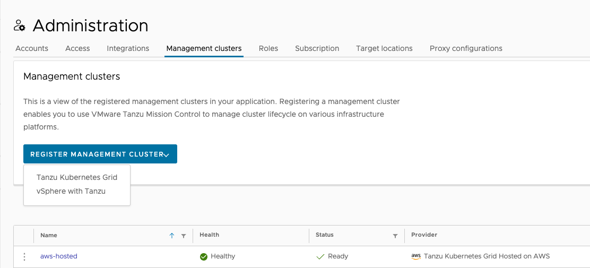
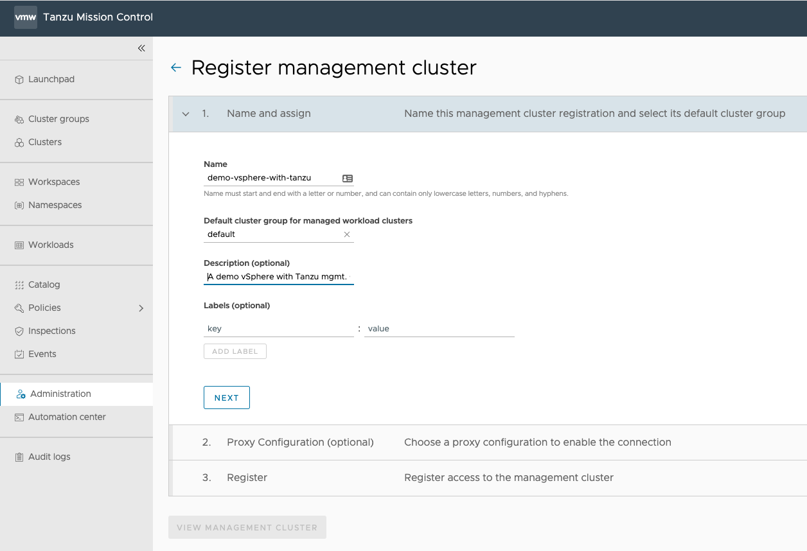
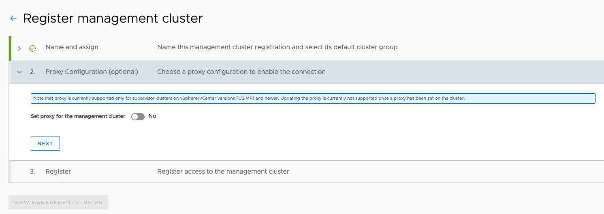
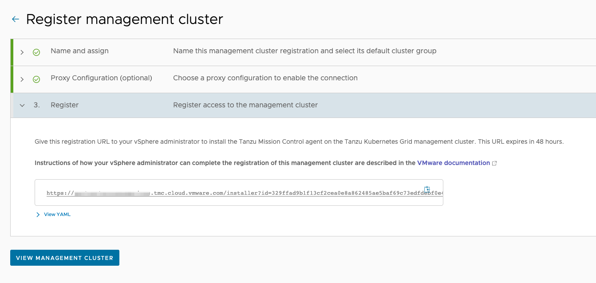
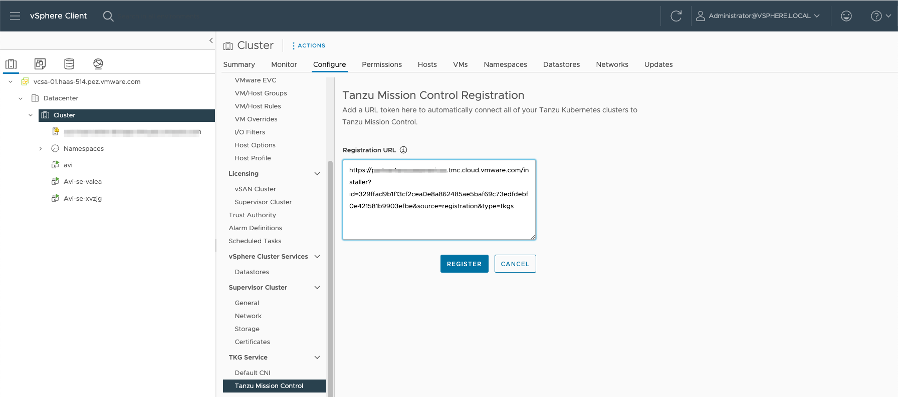
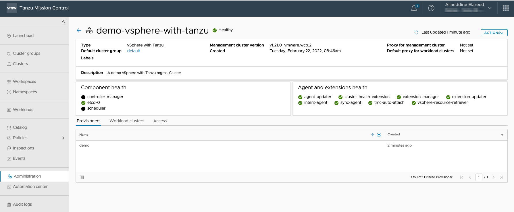

As a platform operator, you can work with your Tanzu Kubernetes Grid administrator to register a management cluster with VMware Tanzu Mission Control to enable lifecycle management of its workload clusters.

When you register a management cluster, you create secure connection to Tanzu Mission Control that allows you to subsequently bring its workload clusters under management, assign them to cluster groups, and apply policies. You can also manage the entire lifecycle of your clusters (including create, update, and delete) from Tanzu Mission Control.

1. In the Tanzu Mission Control console, click **_Administration_** in the left navigation pane.

2. Click the **_Management clusters_** tab.

3. Click **_Register Management Cluster_** , and then choose the kind of cluster you are registering. In this example we'll register a vSphere with Tanzu supervisor cluster as a management cluster.

>**Note** : the registration of Tanzu Kubernetes Grid management cluster on AWS/Azure/vSphere has similar steps, just follow the wizard. For more information, see [Register a Management Cluster with Tanzu Mission Control](ttps://docs.vmware.com/en/VMware-Tanzu-Mission-Control/services/tanzumc-using/GUID-EB507AAF-5F4F-400F-9623-BA611233E0BD.html) in _VMware Tanzu Mission Control Product Documentation_

4. On the Register page, provide a name for the management cluster, and select a default cluster group for workload clusters.

When you add workload clusters, you can choose the cluster group into which to place them. This setting simply indicates the default choice.

5. You can optionally provide a description and labels for the management cluster.

6. Click **_Next_**.

7. You can optionally select a proxy configuration for the cluster.

  i. Click to toggle the **_Set proxy for the management cluster_**  option to **_Yes_**.

  ii. Select the proxy configuration you defined for this cluster.

  iii. You can optionally specify an alternative proxy configuration to use as the default selection for managed workload clusters.

When you add workload clusters, you can choose which proxy configuration to use. This setting simply indicates the default choice.

8. Click Next.

When you click Next, Tanzu Mission Control generates a YAML file that defines how the management cluster connects to Tanzu Mission Control for registration. The credential provided in the YAML expires after 48 hours. You can optionally click View YAML to see the code.

9. Copy the URL provided on the Register page, and give it to the administrator of your Tanzu Kubernetes Grid deployment to install the cluster agent on your management cluster and complete the registration process.

For clusters running in vSphere or vSphere with Tanzu, this is typically the vSphere administrator.

>If you have vCenter/vSphere version prior to 7U3, follow the steps described [here](ttps://docs.vmware.com/en/VMware-Tanzu-Mission-Control/services/tanzumc-using/GUID-CC6E721E-43BF-4066-AA0A-F744280D6A03.html).

10. Click **_View Management Cluster_**.