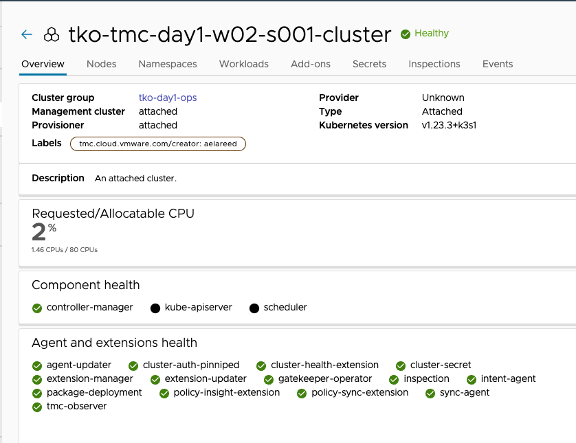
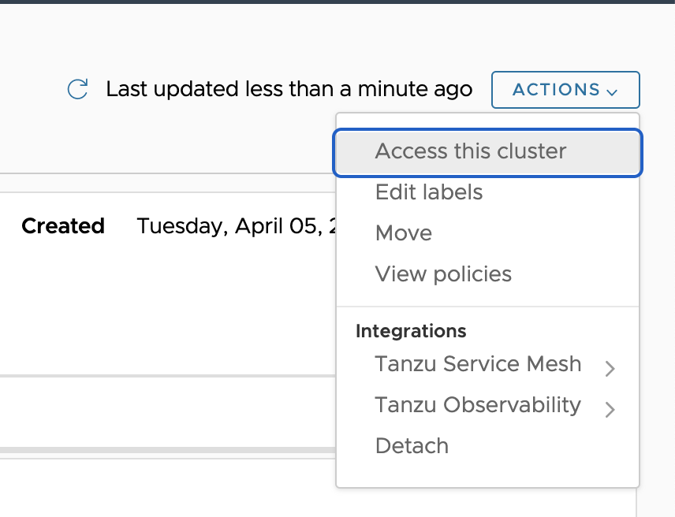
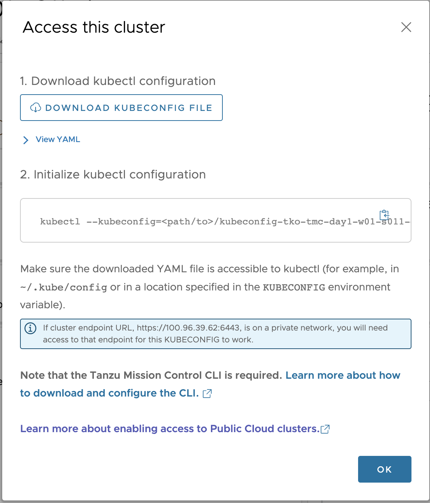

Use VMware Tanzu Mission Control to provision the necessary resources and create a new Tanzu Kubernetes cluster.

**Create and prepare your TMC resources**

* Create your session's **Cluster Group: {{ session_namespace }}-cg**

```execute-1
tmc clustergroup create -n {{ session_namespace }}-cg
```
* Confirm that the cluster group **{{ session_namespace }}-cg** has been created    

```execute-1
tmc clustergroup get {{ session_namespace }}-cg 
```
   
* Add your Cluster Group to the **{{ ENV_DP_LOCATION }}** Backup Location 

```execute-1
tmc dataprotection provider backuplocation update {{ ENV_DP_LOCATION }} --assigned-cluster-groups $(tmc dataprotection provider backuplocation get {{ ENV_DP_LOCATION }} -o json | jq -r '[.spec.assignedGroups[].clustergroup.name] + ["{{ session_namespace }}-cg"] | @csv')
```

* Confirm that the cluster group **{{ session_namespace }}-cg** has been added to **{{ ENV_DP_LOCATION }}** Backup Location 

```execute-1
tmc dataprotection provider backuplocation get {{ ENV_DP_LOCATION }} -o json | jq  '.spec.assignedGroups[].clustergroup | select(.name=="{{ session_namespace }}-cg")'
```
**Provision a Cluster in your vSphere Environment**

<details>
<summary><b>TMC Console</b></summary>
<p>

1. In the left navigation pane of the Tanzu Mission Control console, click **Clusters**.
2. On the Clusters page, click **Create Cluster**.
3. Click to select your management cluster in which to create the new workload cluster, and then click **Continue to Create Cluster**.
4. On the Create cluster page, select the provisioner/vSphere Namespace in which you want to create the cluster.
5. Enter the name, group, and other details for the cluster.

    a.Enter a name for the cluster `{{ session_namespace }}-cluster`{{copy}}.

    b.Cluster names must be unique within an organization.

    c. Select the cluster group: **{{ session_namespace }}-cg** to which you want to attach your cluster .

    d. You can optionally enter a description and apply labels.

    e. Click Next.

6. Select your configuration options.

    a. Select the Kubernetes version to use for the cluster.
    The latest supported version is preselected for you.
    
    b. You can optionally define an alternative CIDR for the pod and service.

    The Pod CIDR and Service CIDR cannot be change after the cluster is created.

    c. You can optionally specify a proxy configuration to use for this cluster.

    >**Note:**
    When provisioning a cluster in vSphere with Tanzu using a proxy, make sure the proxy configuration object includes the CIDRs for pod, ingress, and egress from the workload network of the Supervisor Cluster in the No proxy list.

    d. You can optionally select the default storage class for the cluster and allowed storage classes.
    The list of storage classes that you can choose from is taken from your vSphere namespace.

    e. Click Next.

7. Select the type of cluster you want to create.
The primary difference between the two is that the highly available cluster is deployed with multiple control plane nodes.

    a. Choose the cluster type **Single node**.

    b. You can optionally select a different instance type for the cluster's control plane node and its storage class. Chose **best-effort-small**

    c. You can optionally additional storage volumes for your control plane.

    To configure additional volumes, click Add Volume and then specify the name, mount path, and capacity for the volume. To add another, click Add Volume again.

    d. Click Next.

8. You can optionally define the default node pool and create additional node pools for your cluster.

    a. Specify the number of worker nodes to provision. Set the number of your worker nodes to **2**

    b. Select the instance type for workload clusters. Chose **best-effort-large**

    c. Select the storage class.

    d. To configure additional storage volumes for your node pool, click Add Volume.

    e. To provide labels for the nodes and cloud, enter the label and then click Add Label.

9. When you ready to provision the new cluster, click Create Cluster.

On Tanzu Mission Control console, wait until the creation of your cluster is complete, and then the cluster **{{ session_namespace }}-cluster** state changes to **Healthy**


</p> 
</details>

<details>
<summary><b>Terraform</b></summary>
<p>

1. Set your TMC API Token and terraform variable as environment variables 

```terminal:input
text: export VMW_CLOUD_API_TOKEN=
endl: false
```

```execute-1
export TF_VAR_session_name=$SESSION_NAME
```

2. Update the `main.tf` file with your `provisioner_name` and `storage_class` name 

```editor:open-file
file: ~/terraform/main.tf
```

3. Execute terraform init

```execute-1
cd terraform && terraform init
```

4. Run terraform apply to provision your TKC Cluster using terraform

```execute-1
terraform apply -auto-approve
```

</p> 
</details>
<p>
</p>

<b>Connect to *{{ session_namespace }}-cluster* with kubectl</b>

<details>
<summary><b>TMC Console</b></summary>
<p>

1. In the left navigation pane of the Tanzu Mission Control console, click Clusters.
2. On the Clusters page, click ***{{ session_namespace }}-cluster***.
3. On the cluster detail page, in the upper right corner, click Access this cluster.

4. In the resulting popup modal, click Download KUBECONFIG file. and save the downloaded YAML file in a location that is accessible to kubectl (for example, in `~/.kube/config` or in a location specified in the KUBECONFIG environment variable).

</p> 
</details>


<details>
<summary><b>TMC CLI</b></summary>
<p>

1. Change your current directory to your Home directory

```execute-1
cd
```

2. Download your KUBECONFIG file 

```execute-1
cp .kube/config .kube/eduk8s
tmc cluster auth kubeconfig get {{ session_namespace }}-cluster > .kube/config 
```

3. Let's have a look on the downloaded KUBECONFIG

```editor:open-file
file: .kube/config 
```
</p> 
</details>

<p>
</p>

```execute-1
tmc cluster validate -k .kube/config
```

```execute-all
clear
```

* Create your session's **Workspace: {{ session_namespace }}-ws**

```execute-1
tmc workspace create -n {{ session_namespace }}-ws
```

* Confirm that the workspace **{{ session_namespace }}-ws** has been created    

```execute-1
tmc workspace get {{ session_namespace }}-ws 
```

* Create **{{ session_namespace }}** namespace and add it to the workspace **{{ session_namespace }}-ws**:

```execute-1
tmc cluster namespace create -n {{ session_namespace }} -k {{ session_namespace }}-ws -c {{ session_namespace }}-cluster
```

* Confirm that the Namespace has been created

```execute-1
kubectl get ns {{ session_namespace }} --kubeconfig=.kube/config
```
```execute-all
clear
```