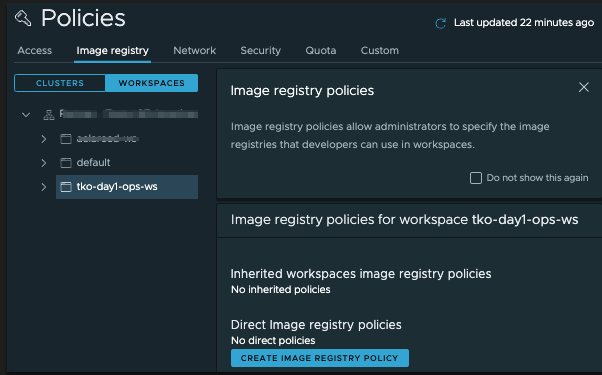
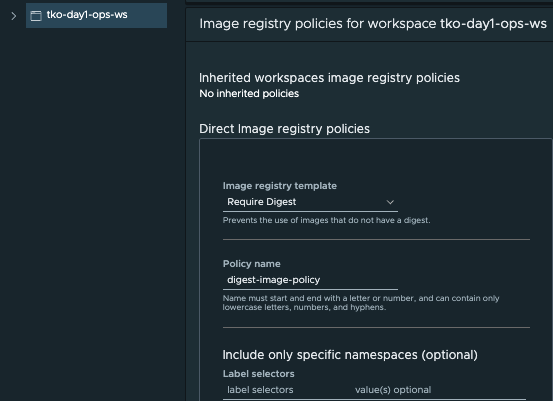
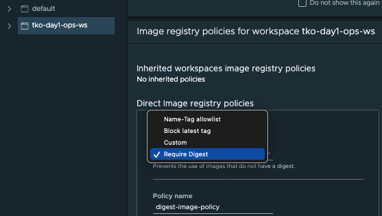

Using VMware Tanzu Mission Control, you can make the deployments to namespaces in your clusters more secure by restricting the image registries from which images can be pulled, as well as the images that can be pulled from a registry. By default, Tanzu Mission Control does not impose any such restriction, and allows you to manage image registry restrictions at the organizational level and at the workspace level.

Tanzu Mission control has Image based policies that can be applied to namespaces within a cluster. These policies can be applied fleet-wide across clusters and clouds by grouping namespaces together in a logical group called Workspaces.

Each namespace and workspace can be protected by an image registry policy that defines the registries from which an image can be pulled, and these policies are inherited down through the organizational hierarchy.

Examples of image registry polices include:

- Implement Policies to not allow images from certain Image Registries
- Policy that prevents container images with no digest from deploying
- Stop container images with latest tag from deploying 
- Blacklist certain images/repos 

<div class="info" style='background-color:#e7f3fe; color: #000000; border-left: solid #2196F3 4px; border-radius: 4px; padding:0.7em;'>
<span>
<p style='margin-top:1em; text-align:left'>
<b>Note:</b></p>
<p style='margin-left:1em;'>
Image registry policies cannot be set at a cluster level. Image policies can be assigned only at workspace level or at the organization level.
</p>
</span>
</div>
<p>
</p>

To create an image registry policy for an object, you must be associated with the **.admin** role for that object

* Click Create Image Registry Policy.
* Select the recipe you want to use.
    * The *`Block latest tag`* recipe prevents the use of images that are tagged latest.
    * The *`Require Digest`* recipe prevents the use of images that do not have a digest.
    * The *`Name-Tag allowlist`* recipe allows you to create rules using an image name or tag name or both.
    * The *`Custom`* recipe allows you to create rules using multiple factors.

As quick example we are going to create a *`Require Digest`* recipe policy using the TMC Console



Select your workspace ***{ session_namespace }}-ws*** and click Create Image 
Registry Policy. We are going to configure that all the container 
images to be deployed to this workspace must have a container digest. 
Under Image registry template dropdown, select Require Digest:



Give it a name such as `{{ session_namespace }}-di-policy`{{copy}} and proceed with default values 
for other fields. If needed, you may specify label selectors to 
include or exclude certain namespaces for this policy. 
Finally click Create Policy. 

The steps above show how to create an image registry policy to require digest. Similarly, image 
registry policies to specify a name-tag allowlist, block the latest tag, or even custom policies may be created:
 


Once created, you may edit or delete an image registry policy.

Let's validate that our image *`Require Digest`* registry policy is working by trying to deploy a container image with and without a gigest to the namespace **{{ session_namespace }}**
 
* Confirm that the policy has been created    
    
    ```execute-1
    tmc workspace image-policy get {{ session_namespace }}-di-policy  --workspace-name {{ session_namespace }}-ws 
    ```
    ```execute-1
    kubectl describe opapolicies.intents.tmc.cloud.vmware.com --kubeconfig=.kube/config wsp.{{ session_namespace }}.{{ session_namespace }}-di-policy.vmware-system-tmc-allowed-images-v1
    ```

* Create a deployment with **nginx** image:

```execute-1
kubectl --kubeconfig=.kube/config create deployment nginx-without-digest --image=nginx -n {{ session_namespace }}
```

* Notice the deployment is blocked and won't progress because of *`Require Digest`* registry policy.

```execute-1
kubectl --kubeconfig=.kube/config get events --field-selector type=Warning -n {{ session_namespace }} --sort-by='.metadata.creationTimestamp'
```

* Confirm that the nginx pod hasn't been deployed

```execute-1
kubectl --kubeconfig=.kube/config get pods -n {{ session_namespace }}
```

* Delete the deployment

```execute-1
kubectl --kubeconfig=.kube/config delete deployment nginx-without-digest -n {{ session_namespace }}
```

```execute-all
clear
```

* Now let's deploy a nginx container with digest to check if the policy will allow it run

```execute-1
kubectl --kubeconfig=.kube/config create deployment nginx-with-digest --image=nginx@sha256:2275af0f20d71b293916f1958f8497f987b8d8fd8113df54635f2a5915002bf1 -n {{ session_namespace }}
```

* Confirm that the nginx pod with the image digest has been deployed

```execute-1
kubectl --kubeconfig=.kube/config get pods -n {{ session_namespace }}
```

* Again, check the events if there is any error, ignore the errors from the previous test


```execute-1
kubectl --kubeconfig=.kube/config get events --field-selector type=Warning -n {{ session_namespace }} --sort-by='.metadata.creationTimestamp'
```

* Delete the deployment

```execute-1
kubectl --kubeconfig=.kube/config delete deployment nginx-with-digest -n {{ session_namespace }}
```

* Delete the created policy 

```execute-1
tmc workspace image-policy delete {{ session_namespace }}-di-policy --workspace-name {{ session_namespace }}-ws
```

```execute-all
clear
```

Now let's create a custom policy in workspace ***{{ session_namespace }}-ws*** that blocks any container image that doesn't have the name `busybox`: 

<div class="info" style='background-color:#e7f3fe; color: #000000; border-left: solid #2196F3 4px; border-radius: 4px; padding:0.7em;'>
<span>
<p style='margin-top:1em; text-align:left'>
<b>Note:</b></p>
<p style='margin-left:1em;'>
When you define a custom policy, you can use wildcards to match specific patterns, for example:
- Registry Hostname (*.mycompany.com)
- Image name (fooservice/*)
- Image tag (v1.*)
</p>
</span>
</div>
<p>
</p>
<details>
<summary><b>TMC Console</b></summary>
<p>

1. Click Workspaces under the Image Registry tab in the Policies page and select workspace ***{{ session_namespace }}-ws***

2. Click Create Image Registry Policy

  

3. Choose Custom in the Image Registry Template field and give it a name 
  such as `{{ session_namespace }}-ip-ui`{{copy}} in the Policy Name field. Under the Rule pane, type in `library/busybox`{{copy}} in the Image Name field. Optionally, you may specify the hostname and port to restrict where the images are pulled from. In addition, you may add more rules by clicking Add Another Rule.

  

4. Optionally, this custom rule may be made to apply to certain namespaces of this workspace if desired by specifying the Label Selectors fields. At the end, click Create Policy.
</p>
</details>
<p>
</p>
<details>
<summary><b>TMC CLI</b></summary>
<p>

Before we apply this policy using the TMC CLI, let's have a look on its definition and do some modifications

```editor:open-file
file: ~/busybox-image-policy.yaml
```

```editor:select-matching-text
file: ~/busybox-image-policy.yaml
text: "workspaceName: (.*)"
isRegex: true
group: 1
```

```editor:replace-text-selection
file: ~/busybox-image-policy.yaml
text: "{{ session_namespace }}-ws"
```
* Create the image policy 

    ```execute-1
    tmc workspace image-policy create -f busybox-image-policy.yaml 
    ```
* Confirm that the image policy has been created and synced to the {{ session_namespace }}-cluster   

    ```execute-1
    tmc workspace image-policy get busybox-ip-cli --workspace-name {{ session_namespace }}-ws 
    ```

    ```execute-1
    kubectl describe opapolicies.intents.tmc.cloud.vmware.com --kubeconfig=.kube/config wsp.{{ session_namespace }}.busybox-ip-cli.vmware-system-tmc-allowed-images-v1
    ```
* Repeat the previous command until the policy **Status** changes to **True**    
</p>
</details>
<p>
</p>

<div class="info" style='background-color:#e7f3fe; color: #000000; border-left: solid #2196F3 4px; border-radius: 4px; padding:0.7em;'>
<span>
<p style='margin-top:1em; text-align:left'>
<b>Note:</b></p>
<p style='margin-left:1em;'>
Sometimes it take a few seconds for the policy to be effective. If the test below fails, please delete the deployment and redeploy again.   
</p>
</span>
</div>
<p>
</p>

Let's validate that our image registry policy is working by trying to deploy the busybox image and non-busybox image to the namespace **{{ session_namespace }}**, 
which is part of the workspace **{{ session_namespace }}-ws**. 

* Create a deployment with **nginx** image:

```execute-1
kubectl --kubeconfig=.kube/config create deployment nginx --image=nginx -n {{ session_namespace }}
```

* Confirm that the nginx pod hasn't been deployed

```execute-1
kubectl --kubeconfig=.kube/config get pods -n {{ session_namespace }}
```

* Notice the deployment is blocked and won't progress because of the image policy that allows only busybox image name to be deployed

```execute-1
kubectl --kubeconfig=.kube/config get events --field-selector type=Warning -n {{ session_namespace }} --sort-by='.metadata.creationTimestamp'
```

* Delete the deployment

```execute-1
kubectl --kubeconfig=.kube/config delete deployment nginx -n {{ session_namespace }}
```

```execute-all
clear
```

* Now let's deploy a busybox container to check if the policy will allow it run

```execute-1
kubectl --kubeconfig=.kube/config apply -f busybox-deployment.yaml -n {{ session_namespace }}
```
* Confirm that the busybox pod has been deployed

```execute-1
kubectl --kubeconfig=.kube/config get pods -n {{ session_namespace }}
```
* Again, check the events if there is any error

```execute-1
kubectl --kubeconfig=.kube/config get events --field-selector type=Warning -n {{ session_namespace }} --sort-by='.metadata.creationTimestamp'
```

* Delete the created policy 

```execute-1
tmc workspace image-policy delete busybox-ip-cli --workspace-name {{ session_namespace }}-ws 
```
* Delete the busybox deployment

```execute-1
kubectl --kubeconfig=.kube/config delete -f busybox-deployment.yaml -n {{ session_namespace }}
```

Now, let's create a policy that will allow pulling images from a particular container registry only


<details>
<summary><b>TMC CLI</b></summary>
<p>

Before we apply this policy using the TMC CLI, let's have a look on its definition:

```editor:open-file
file: ~/registry-hotsname-policy.yaml
```

```editor:select-matching-text
file: ~/registry-hotsname-policy.yaml
text: "workspaceName: (.*)"
isRegex: true
group: 1
```

```editor:replace-text-selection
file: ~/registry-hotsname-policy.yaml
text: "{{ session_namespace }}-ws"
```

* Create a policy 

    ```execute-1
    tmc workspace image-policy create -f registry-hotsname-policy.yaml
    ```
* Confirm that the policy has been created    

    ```execute-1
    tmc workspace image-policy get registry-hotsname-policy --workspace-name {{ session_namespace }}-ws 
    ```
    ```execute-1
    kubectl describe opapolicies.intents.tmc.cloud.vmware.com --kubeconfig=.kube/config wsp.{{ session_namespace }}.registry-hotsname-policy.vmware-system-tmc-allowed-images-v1
    ```

* Repeat the previous command until the policy **Status** changes to **True**  

* Create a deployment with **nginx** image from **docker hub**:

    ```execute-1
    kubectl --kubeconfig=.kube/config create deployment nginx --image=nginx -n {{ session_namespace }}
    ```

* Confirm that the nginx pod hasn't been deployed

    ```execute-1
    kubectl --kubeconfig=.kube/config get pods -n {{ session_namespace }}
    ```
* Notice the deployment is blocked and won't progress because of the registry rules.

    ```execute-1
    kubectl --kubeconfig=.kube/config get events --field-selector type=Warning -n {{ session_namespace }} --sort-by='.metadata.creationTimestamp'
    ```
* Delete the deployment

    ```execute-1
    kubectl --kubeconfig=.kube/config delete deployment nginx -n {{ session_namespace }}
    ```

    ```execute-all
    clear
    ```
* Delete the created policy 

    ```execute-1
    tmc workspace image-policy delete registry-hotsname-policy --workspace-name {{ session_namespace }}-ws
    ```
</p>
</details>


