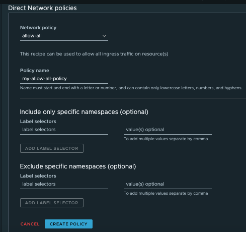

Using VMware Tanzu Mission Control, you can create a network policy that defines how pods communicate with each other and other network endpoints, using preconfigured templates called recipes. By default, Tanzu Mission Control does not impose any such restriction, and allows you to manage network restrictions at the organizational level and at the workspace level.

Tanzu Mission Control implements network policies using Kubernetes native network policies. Each namespace and workspace can be governed by a network policy, and these policies are inherited down through the organizational hierarchy. Network policies are additive, both inherited and direct network policies are applied and are effective on your namespaces according to Kubernetes rules.

To create a network policy for an object, you must be associated 
with the *.admin* role for that object.

Let us follow the following procedure to create a network policy that allows all ingress
traffic in our workspace  *tko-day1-ops-ws*:

1. On the Policies page, click the Network tab, and then click the Workspaces organization view.

1. Use the tree control to navigate to and select the object for which you want to create a network policy.  In this case, click *tko-day1-ops-ws* to add a network policy for this workspace.

  

3. Click Create Network Policy.

4. Select the network policy recipe to use. Choose one of the values from the dropdown. Available values 
are: *allow-all* (allow all ingress traffic), *deny-all* (deny all ingress traffic), *allow-all-to-pods* (allow all ingress traffic to selected pods), *deny-all-to-pods* (deny all ingress traffic to selected pods), *custom-ingress* (define a custom ingress policy), *custom-egress* (define an egress policy). In this case, we select *allow-all*.

5. Provide a policy name: `{{ session_namespace }}-allow-all-policy`{{copy}}.

6. If you select a pod-specific recipe, you must specify the labels to identify the pods 
to which the policy applies. Under Labels, enter the key and value 
on which to filter pods.  Click Add Label.
You can optionally repeat this step to add multiple labels. Each label that you add 
increases the potential group of pods that are impacted by the policy. 
The policy impacts the pods that have any of the labels that you include.

1. If you select the custom-egress or custom-ingress recipe, you can add a rule to define criteria to restrict network traffic. 

1. Click Create Policy.

   

